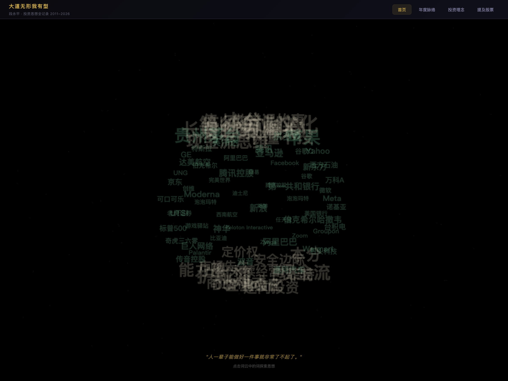
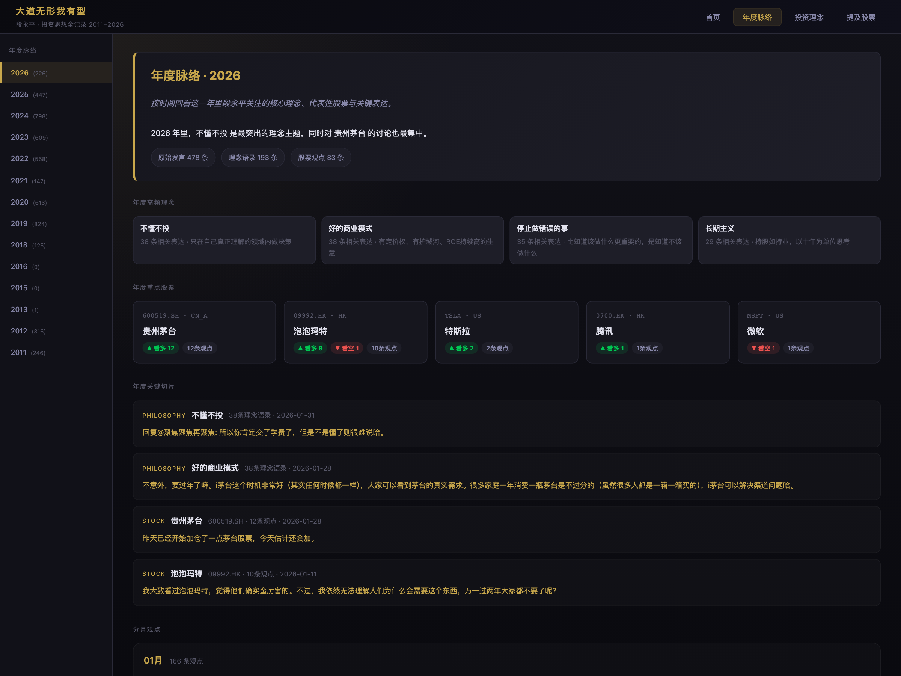
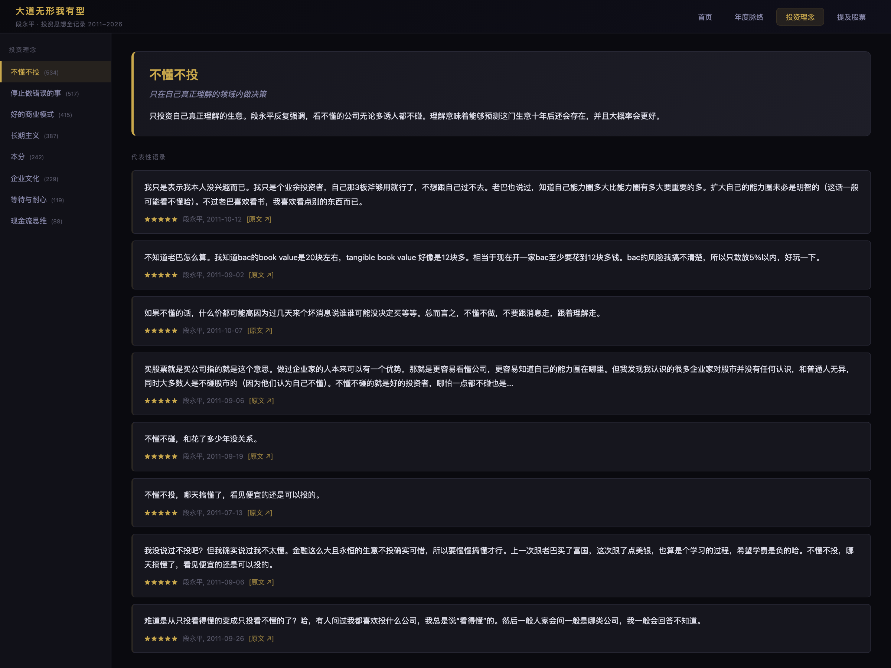
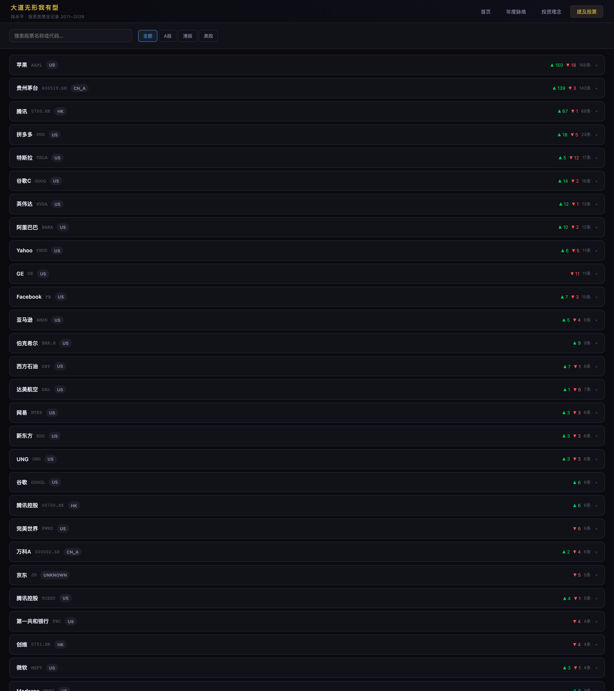

# 段永平投资思想可视化平台
# Duan Yongping Investment Philosophy Explorer

一个围绕段永平公开发言构建的可视化网页项目，用词云、年度脉络、投资理念和股票观点等多种方式，帮助用户从不同维度理解其投资思想演变。

An interactive web project built around Duan Yongping's public statements. It helps readers explore how his investment thinking evolves through a word cloud, yearly timeline, philosophy view, and stock-opinion view.

## 项目亮点
## Highlights

- 首页使用 3D 词云快速展示核心理念与重点股票。
- The home page uses a 3D word cloud to surface key philosophies and important stocks.

- “年度脉络”按年份组织理念、股票和月度观点，便于观察思想变化。
- The "Yearly Timeline" organizes philosophies, stocks, and monthly posts by year so trend changes are easier to follow.

- “投资理念”将观点归纳为多个主题，并附带代表性语录与相关股票。
- The "Philosophy" tab groups ideas into themes and shows representative quotes and related stocks.

- “提及股票”支持筛选、搜索、展开详情，并直接查看 K 线、统计和观点。
- The "Stocks" tab supports filtering, search, expandable details, and direct access to charts, stats, and opinions.

- 针对移动端做了响应式适配，包含导航、卡片布局和 K 线弹窗体验优化。
- The UI includes responsive mobile adaptations for navigation, card layout, and chart modal usability.

## 技术栈
## Tech Stack

- 后端：`Flask`
- Backend: `Flask`

- 数据处理：`pandas`、`yfinance`、`akshare`
- Data processing: `pandas`, `yfinance`, `akshare`

- 前端：原生 `HTML / CSS / JavaScript`
- Frontend: vanilla `HTML / CSS / JavaScript`

- 图表与可视化：`ECharts`、`Three.js`
- Charts and visualization: `ECharts`, `Three.js`

## 本地运行
## Run Locally

### 1. 安装依赖
### 1. Install dependencies

```bash
python3 -m venv .venv
source .venv/bin/activate
pip install -r requirements.txt
```

### 2. 启动服务
### 2. Start the server

```bash
python3 app.py
```

默认访问地址：
Default URL:

```text
http://127.0.0.1:5001
```

如果 `5001` 端口被占用，可以改用其他端口：
If port `5001` is already in use, run on another port:

```bash
python3 - <<'PY'
from app import app
app.run(debug=True, host="0.0.0.0", port=5002)
PY
```

## 生产部署
## Production Deployment

- 阿里云 ECS + 域名上线步骤见 [DEPLOY_ALIYUN.md](/Users/haitao/Documents/duanyongping/DEPLOY_ALIYUN.md)
- For Alibaba Cloud ECS deployment, follow [DEPLOY_ALIYUN.md](/Users/haitao/Documents/duanyongping/DEPLOY_ALIYUN.md)

- 上线前建议先生成本地快照，避免线上再请求第三方股票接口：
- Before deployment, build local snapshots so production does not request third-party stock providers:

```bash
python3 scripts/build_deploy_snapshot.py
```

- 生成后的发布数据会单独放在 `deploy_snapshot/current/` 目录。
- The generated deploy-ready data is stored separately under `deploy_snapshot/current/`.

- 如需继续跑抽取脚本，请基于 `config.example.json` 在本地手动创建不入库的 `config.json`。
- If you need to rerun extraction pipelines, create a local untracked `config.json` from `config.example.json`.

## 主要页面
## Main Views

- `首页 / Home`
  核心理念与重点股票的 3D 词云入口。
  3D word cloud entry point for key philosophies and important stocks.

- `年度脉络 / Timeline`
  从 2011 到 2026 的年度视图，包含高频理念、重点股票、关键切片和分月观点。
  A year-by-year view from 2011 to 2026, including key philosophies, top stocks, important moments, and monthly posts.

- `投资理念 / Philosophy`
  主题化展示段永平的思考框架与代表性语录。
  A thematic view of Duan Yongping's thinking framework and representative quotes.

- `提及股票 / Stocks`
  展示他讨论过的股票，并附带观点、统计与价格走势。
  Shows the stocks he talked about together with opinions, statistics, and price trends.

## 页面截图
## Screenshots

### 首页 / Home

首页以 3D 词云作为第一入口，适合快速浏览核心理念与高频提及股票。
The home tab uses a 3D word cloud as the first entry point for quickly exploring key ideas and frequently mentioned stocks.



### 年度脉络 / Yearly Timeline

年度脉络按照年份组织关键理念、重点股票、关键切片和分月观点，便于观察思想演化。
The timeline tab organizes key philosophies, top stocks, important moments, and monthly posts by year, making the evolution of ideas easier to follow.



### 投资理念 / Philosophy

投资理念页将发言归纳为主题，并展示代表性语录和关联股票。
The philosophy tab groups statements into themes and highlights representative quotes together with related stocks.



### 提及股票 / Stocks

提及股票页支持按市场筛选、搜索和展开查看观点详情，是查看个股观点与统计的主要入口。
The stocks tab supports market filters, search, and expandable details, and serves as the main entry point for stock-level opinions and statistics.



## 项目结构
## Project Structure

```text
app.py                 Flask 入口
core/                  数据抓取、统计与分析逻辑
static/                前端样式与脚本
templates/             HTML 模板
cache/                 已处理的数据缓存与索引
pipeline/              数据管道相关脚本
```

## 数据说明
## Data Notes

- `cache/index/` 中保存了首页、理念和股票页使用的聚合索引。
- `cache/index/` stores aggregated indexes used by the home, philosophy, and stock views.

- `cache/posts/`、`cache/philosophy_quotes/`、`cache/stock_opinions/` 中保存了细粒度内容。
- `cache/posts/`, `cache/philosophy_quotes/`, and `cache/stock_opinions/` store the detailed content.

- 股票行情会缓存到 `cache/ohlc/`，避免重复请求第三方数据源。
- Stock OHLC data is cached in `cache/ohlc/` to reduce repeated requests to external providers.

## 说明
## Notes

- 这是一个研究与可视化项目，不构成任何投资建议。
- This repository is for research and visualization only and does not constitute investment advice.

- 第三方行情和内容来源可能受接口限制、缓存状态和时间窗口影响。
- Third-party market data and content sources may vary due to rate limits, cache state, or time-window differences.
